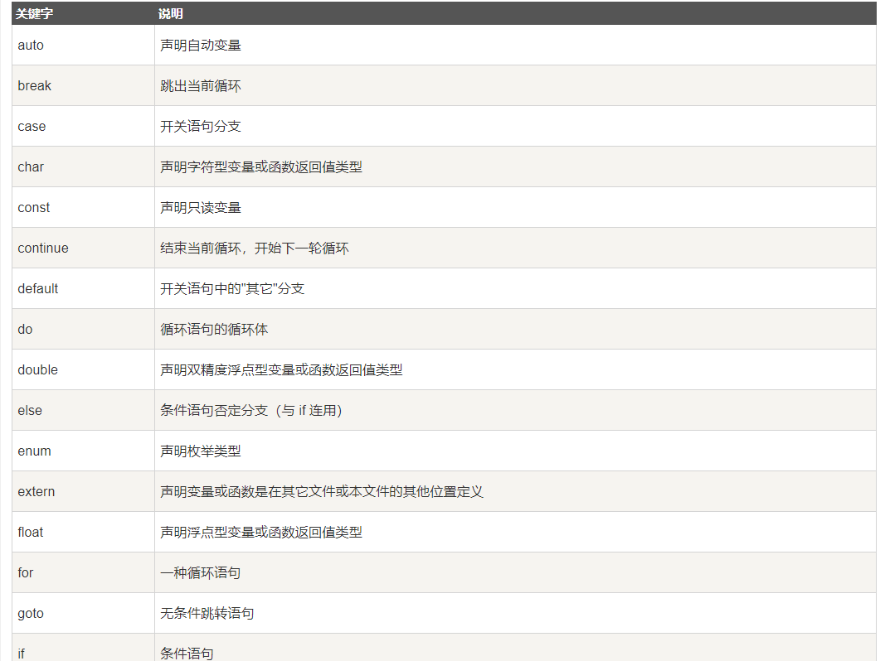
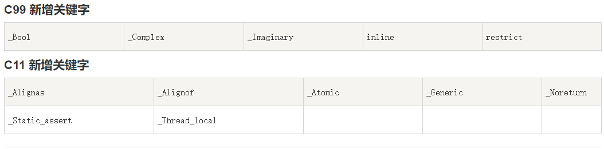
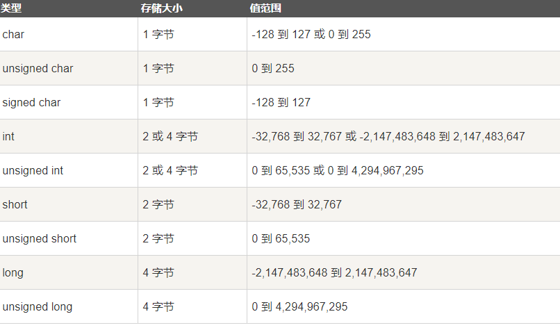
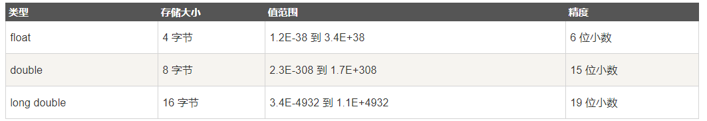

# 		备考2021考研-c语言汇总

### 第一个c语言程序

```
#include<stdio.h>
/*
这一句话是必须要的格式
stdio 表示系统文件库, 也可以声明其它的
.h  表示头文件,因为这些文件都是放在程序各文件的开头
#include 告诉预处理器将指定头文件的内容插入到预处理器命令的相应位  导入头文件的预编译指令
<> 表示系统自带的库
也可以写成" " 表示用户自定义的库
如果写成" "并且自定义的库里面没有这个文件系统会自动查找自带的库,如果还是没有报错
*/

int main()  // 程序的入口
{
	/*
int 表示数字格式,返回一个数字
main()主函数 表示程序的入口  一个程序有且只能有一个main函数的存在
*/
    printf("hello,World");//打印一个helloworld
    return 0; //返回一个整数0,因为它是int类型,所以只能返回整数
}  //程序从这里结束
```

#### 编写第一个c程序

hello.c

```
#include<stdio.h>
int main(){
    
    printf("hello\n");
    return 0;
}
```

编译并运行 ,使用gcc命令编译后会生成一个a.out文件

```
gcc hello.c&&a.out
```

使用gcc命令前查询是否安装gcc

```
gcc -v
```

如果未安装命令,请先进行安装

多个.c文件的编译与运行方式

```
$ gcc test1.c test2.c -o main.out
$ ./main.out    //test1.c 与 test2.c 是两个源代码文件。
```

### 基本语法

#### 注释

和大多数语言一样分为单行注释和多行注释

```
// 单行注释
/*

 多行注释
*/
```

#### 标识符

C 标识符是用来标识变量、函数，或任何其他用户自定义项目的名称。一个标识符以字母 A-Z 或 a-z 或下划线 _ 开始，后跟零个或多个字母、下划线和数字（0-9）。

C 标识符内不允许出现标点字符，比如 @、$ 和 %。C 是**区分大小写**的编程语言。因此，在 C 中，*Manpower* 和 *manpower* 是两个不同的标识符。下面列出几个有效的标识符：

```
mohd       zara    abc   move_name  a_123
myname50   _temp   j     a23b9      retVal
```

#### 关键字

下表列出了 C 中的保留字(非完整版)。这些保留字不能作为常量名、变量名或其他标识符名称。 



#### C99和c11新增的关键词



#### C 中的空格

只包含空格的行，被称为空白行，可能带有注释，C 编译器会完全忽略它。 

在 C 中，空格用于描述空白符、制表符、换行符和注释。 c语言进行识别从哪里结束,下一个从什么地方开始

```
int age;
//int 和 age 之间必须至少有一个空格字符（通常是一个空白符），这样编译器才能够区分它们
```

```
fruit = apples + oranges;   // 获取水果的总数
//fruit 和 =，或者 = 和 apples 之间的空格字符不是必需的，但是为了增强可读性，您可以根据需要适当增加一些空格
```

### 数据类型

每一种编程语言都要先去了解一下他的数据类型

c语言数据类型大致分为:

#### 1.基本类型

它们是算术类型，包括两种类型：整数类型和浮点类型。 

##### 整型的每种类型所占内存的空间



使用代码进行判断不同类型所占的空间(sizeof)

```
#include <stdio.h>
#include <limits.h>
int main()
{
   printf("int 存储大小 : %lu \n", sizeof(int));  //4
   printf("unsigned int 存储大小 : %lu \n", sizeof(unsigned int));  /4
   printf("short 存储大小 : %lu \n", sizeof(short));  //2
   printf("long 存储大小 : %lu \n", sizeof(long));  //8
   printf("unsigned long 存储大小 : %lu \n", sizeof(unsigned long));  //8
   printf("unsigned short 存储大小 : %lu \n", sizeof(unsigned short));  /2
   return 0;
}
```

**%lu** 为 32 位无符号整数， linux运行sizeof(int)结果为4字节


##### 浮点型所占内存的空间



代码使用sizeof计算

```
#include <stdio.h>
#include <float.h>
 
int main()
{
   printf("float 存储最大字节数 : %lu \n", sizeof(float));
   printf("float 最小值: %E\n", FLT_MIN ); //%E 为以指数形式输出单、双精度实数，
   printf("float 最大值: %E\n", FLT_MAX );
   printf("精度值: %d\n", FLT_DIG );
   
   return 0;
}
```

运行结果

```
float 存储最大字节数 : 4 
float 最小值: 1.175494E-38
float 最大值: 3.402823E+38
精度值: 6

```


####2.枚举类型

它们也是算术类型，被用来定义在程序中只能赋予其一定的离散整数值的变量。 

####3.void类型

类型说明符 *void* 表明没有可用的值。 

####4.派生类型

它们包括：指针类型、数组类型、结构类型、共用体类型和函数类型。 

#### 基本类型的总结

```
常用基本数据类型占用空间（64位机器为例）

 char ： 1个字节
 int ：4个字节
 float：4个字节
 double：8个字节
 
基本类型书写
整数
 a，默认为10进制 ，10 ，20。
 b，以0开头为8进制，045，021。
 c.，以0b开头为2进制，0b11101101。
 d，以0x开头为16进制，0x21458adf。
小数

单精度常量：2.3f 。

双精度常量：2.3，默认为双精度。

字符型常量

用英文单引号括起来，只保存一个字符'a'、'b' 、'*' ，还有转义字符 '\n' 、'\t'。

字符串常量

用英文的双引号引起来 可以保存多个字符："abc"。
```

### 变量

变量所谓就是可以变化的量,用来存储c语言的可操作存储区域的名称

#### 变量的声明

```
type(有效的变量类型)  变量名称 
```

有效代码实现一个变量 的声明

```
int age,ij,k;
char c,h;
float f,price;
double;
```

变量初始化

````
int i=0,j,k;//声明变量ijk,并初始化i
````

####C 中的变量声明

变量声明向编译器保证变量以指定的类型和名称存在，这样编译器在不需要知道变量完整细节的情况下也能继续进一步的编译。变量声明只在编译时有它的意义，在程序连接时编译器需要实际的变量声明。 

变量的声明有两种情况：

- 1、一种是需要建立存储空间的。例如：int a 在声明的时候就已经建立了存储空间。
- 2、另一种是不需要建立存储空间的，通过使用extern关键字声明变量名而不定义它。 例如：extern int a 其中变量 a 可以在别的文件中定义的。
- 除非有extern关键字，否则都是变量的定义。

```
extern int i; //声明，不是定义
int i; //声明，也是定义
```

区别: 含有extern不需要划分存储空间,只是声明了变量,没有进行定义

读取内存的地址

```
#include <stdio.h>
int main(){
int a,b;
a=10;
printf("a的地址是%p,b的地址是%p\n",&a,&b);
printf("a的值是%d,b的值是%d\n",a,b);
return 0; 
} 
```

### printf函数相关

前面看到了printf中的%s,%d,数字后的f究竟表达什么含义,我们这次来探究一下!
